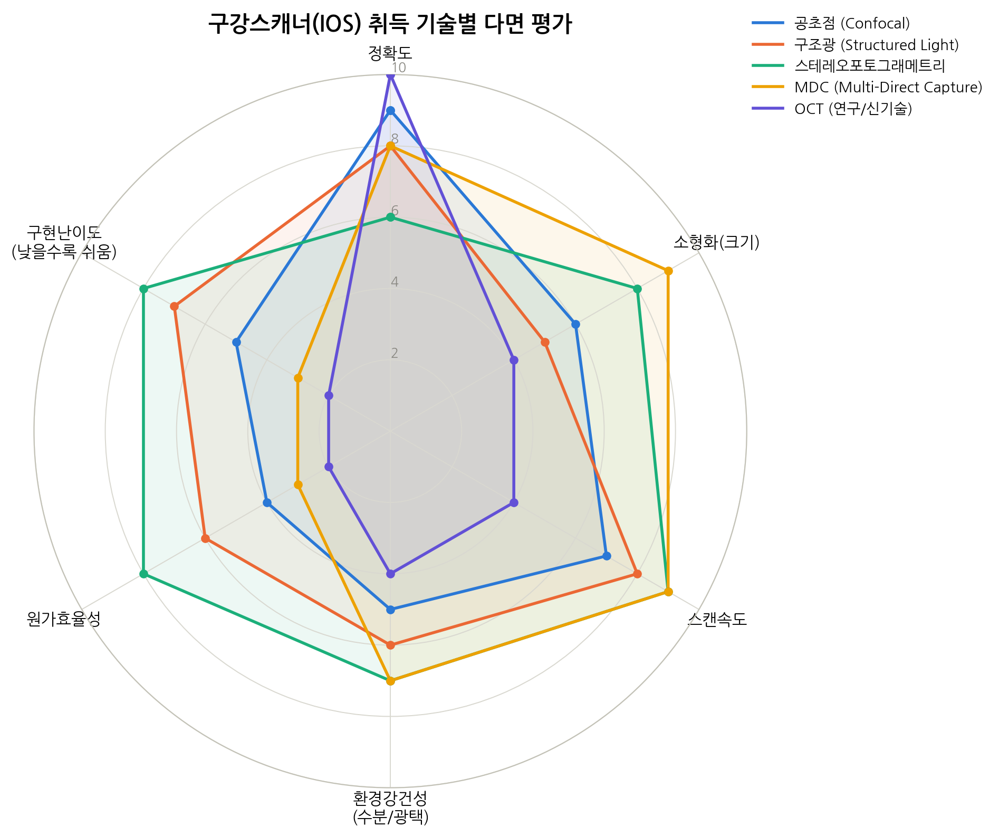

# Intraoral Scanner(IOS) 개발을 위한 취득 기술 검토 보고서

작성일: 2026-09-28
작성자: 나무 / Multimix

---

## 1. 개요

구강 스캐너(Intraoral Scanner, IOS) 개발을 위해 현재 상용/연구 단계에 있는 5개
광학 취득(acquisition) 기술을 정확도, 소형화, 스캔속도, 환경강건성, 원가효율성,
구현난이도 6개 축으로 평가하였다. 평가는 최근 치과학 저널(2025~2026) 비교 연구와
MEMS/광학 스캐닝 엔진 관련 공학 문헌을 근거로 하였다.

---

## 2. 평가 대상 기술

| # | 기술 | 대표 제품/사례 | 핵심 원리 |
|---|------|----------------|-----------|
| 1 | 공초점 현미경(Confocal Microscopy) | TRIOS 5, CS3800 | 파장(UV~적색) 대역 스캐닝, 초점면 변화로 깊이 측정 |
| 2 | 구조광 삼각측량(Structured Light) | Medit i700, Helios 600, AS260 | 패턴 투사 후 왜곡 분석으로 형상 재구성 |
| 3 | 스테레오포토그래메트리 /  Active Wavefront Sampling | 초기 Cadent/iTero | 스테레오 카메라 쌍의 삼각측량 |
| 4 | MDC(Multi-Direct Capture) | iTero Lumina  (2024 신기술) | 전면 광원 배열로 FOV 제약 극복 |
| 5 | OCT(Optical Coherence Tomography) | 연구/의료 내시경용 | 간섭계 기반 초소형 프로브, MEMS 미러 빔스티어링 |

---

## 3. 평가 근거 (기술별 요약)

### 3.1 공초점 현미경(Confocal)
- Full-arch 비교 연구에서 공초점 방식이 구조광 대비 우수한 trueness/precision을
  보이는 경향이 반복적으로 보고됨 — 4개의 8mm 금속구를 이용한 좌표측정기 대조
  실험에서 확인.
- 초점 스캐닝 메커니즘(가변초점) 특성상 광학계가 복잡해지고, 소형화·전력
  최적화가 상대적으로 어려움.
- **평가**: 정확도 9 / 소형화 6 / 속도 7 / 강건성 5 / 원가효율성 4 / 구현난이도 5

### 3.2 구조광 삼각측량(Structured Light)
- 패턴 프로젝터 + 카메라 조합으로 왜곡을 분석해 형상을 재구성하는 방식으로,
  레퍼런스 구현체와 오픈 알고리즘(구조광 디코딩, phase-shifting 등)이 풍부해
  독자 개발 진입장벽이 낮음.
- 구강 내 습기·법랑질 반사면에서 정확도 저하가 보고되며, 조도 조건(500~6000
  lux)에 따라서도 정확도 편차가 발생.
- **평가**: 정확도 8 / 소형화 5 / 속도 8 / 강건성 6 / 원가효율성 6 / 구현난이도 7

### 3.3 스테레오포토그래메트리(Stereophotogrammetry / AWS)
- 스테레오 카메라 쌍의 삼각측량 기반으로, 알고리즘이 상대적으로 단순하고
  부품 수를 최소화할 수 있어 소형화·원가 측면에서 유리.
- 정확도는 공초점·구조광 대비 다소 낮은 편이나, 독자 개발 관점에서는 가장
  현실적인 진입 지점.
- **평가**: 정확도 6 / 소형화 8 / 속도 9 / 강건성 7 / 원가효율성 8 / 구현난이도 8

### 3.4 MDC(Multi-Direct Capture)
- 2024년 2월 Align Technology가 iTero Lumina에 도입한 신기술로, 기존
  "빔 단면적에 비례한 FOV" 제약을 구조적으로 해소.
- 소형화·스캔속도는 최상위권이나, 특허·SW 복잡도가 매우 높아 독자 개발
  난이도가 가장 큼.
- **평가**: 정확도 8 / 소형화 9 / 속도 9 / 강건성 7 / 원가효율성 3 / 구현난이도 3

### 3.5 OCT(연구/신기술)
- MEMS 스캐닝 미러(미러 지름 1.2mm급까지 축소 가능)를 이용해 내시경급
  프로브(외경 4~5.5mm)까지 구현된 연구 사례가 존재.
- 이론적 해상도는 서브마이크론 수준으로 최고이나, 신호처리 부하·프레임레이트·
  비용 문제로 실시간 구강 스캐너 상용화 사례는 드묾.
- **평가**: 정확도 10 / 소형화 4 / 속도 4 / 강건성 4 / 원가효율성 2 / 구현난이도 2

---

## 4. 종합 평가표

| 기술 | 정확도 | 소형화 | 속도 | 강건성 | 원가효율성 | 구현난이도 |
|------|:---:|:---:|:---:|:---:|:---:|:---:|
| 공초점 | 9 | 6 | 7 | 5 | 4 | 5 |
| 구조광 | 8 | 5 | 8 | 6 | 6 | 7 |
| 스테레오포토그래메트리 | 6 | 8 | 9 | 7 | 8 | 8 |
| MDC | 8 | 9 | 9 | 7 | 3 | 3 |
| OCT | 10 | 4 | 4 | 4 | 2 | 2 |

(척도: 1=낮음/불리, 10=높음/유리, 구현난이도는 "낮을수록 쉬움"을 높은 점수로 환산)

---

## 5. 결론 및 방향성

- **독자 개발 관점(1인/소규모 팀, 임베디드·광학 엔지니어링 역량 기반)**에서는
  스테레오포토그래메트리 + 구조광 하이브리드가 가장 현실적인 시작점.
- 정확도가 핵심 요구사항일 경우, 2단계에서 공초점 원리의 부분 도입(가변초점
  렌즈 + 라인스캔)을 검토.
- 최종 소형화 목표를 위해서는 PZT MEMS 미러 등 상용 반도체 소자 소싱이
  필요하며, 이는 로드맵 3단계 과제로 분리.

세부 개발 단계와 부품 스펙은 별첨 로드맵 문서(`IOS_개발로드맵_BOM.md`) 참조.
